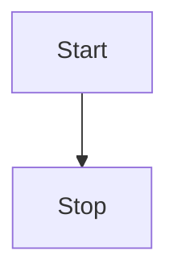

# Config

This is where you configure SilverBullet to your liking. See [[^Library/Std/Config]] for a full list of configuration options.

```space-lua
config.set {
  plugs = {
    "github:silverbulletmd/silverbullet-mermaid/mermaid.plug.js"
    -- Add your plugs here (https://silverbullet.md/Plugs)
    -- Then run the `Plugs: Update` command to update them
  }
}


config.set("index.search.enable", false)
config.set("index.paragraph.all", false)

```


